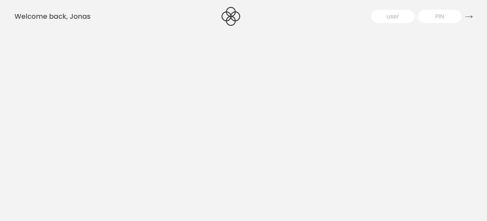
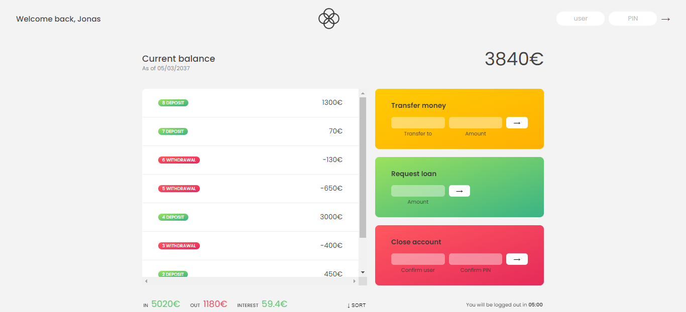

# Bankist-app-using-arrays
Bankist is a fictional and minimalistic online banking application.
Everything you need in a modern bank and more. · 100% digital bank · Watch your money grow · Free debit card included.

# What is Bankist?
Bankist is a fictional online bank. It is a project introduced by Jonas Schmedtmann in order to practice arrays and its methods. Bankist has an option to log in to the account and use different functionalities, almost like in an actual bank!

# Functionalities
* Login
* Transfer a value to another account
* Get loans
* Close (delete) account

# Log in credentials :

This is the template login details to use the bank functionality. The project does not include any backend and does not have an actual registration funcionality. Make sure to use usernames are lowercase!

| Username | UserId | Password |
|----------|----------|----------|
| Jonas Schmedtmann| js| 1111|
| Jessica Davis| jd| 2222|

# Technologies Used
* HTML
* CSS
* Vanilla JavaScript

# Screenshots

### Built with
- Semantic HTML5 markup
- CSS custom properties
- Javascript
- Flexbox
- Grid
- [👉Live Preview👈]()
